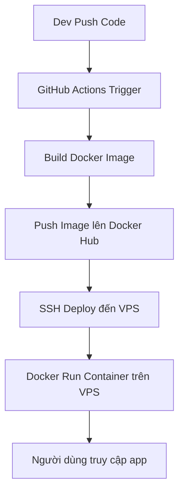

# CI/CD Mô Hình cho Dự Án PHP Backend và HTML Frontend

## 🧱 Cấu trúc thư mục dự án

```bash
ci-cd-project/
├── backend/
│   ├── index.php
│   ├── Dockerfile
│   └── .github/
│       └── workflows/
│           └── backend.yml
│
├── frontend/
│   ├── index.html
│   ├── Dockerfile
│   └── .github/
│       └── workflows/
│           └── frontend.yml
```
---

## 🔁 CI/CD Workflow tổng quát



---

## ⚙️ Nội dung các file chính

### 📄 `backend/Dockerfile`

```Dockerfile
FROM php:8.1-cli
WORKDIR /var/www/html
COPY . .
CMD [ "php", "-S", "0.0.0.0:8000" ]
```

---

### 📄 `frontend/Dockerfile`

```Dockerfile
FROM nginx:alpine
COPY . /usr/share/nginx/html
```

---

### 📄 `.github/workflows/backend.yml`

```yaml
name: Backend CI/CD
on:
  push:
    paths:
      - 'backend/**'
jobs:
  deploy:
    runs-on: ubuntu-latest
    steps:
      - uses: actions/checkout@v3
      - name: Login DockerHub
        run: echo "${{ secrets.DOCKER_PASSWORD }}" | docker login -u "${{ secrets.DOCKER_USERNAME }}" --password-stdin
      - run: docker build -t yourdockeruser/backend:latest ./backend
      - run: docker push yourdockeruser/backend:latest
      - uses: appleboy/ssh-action@master
        with:
          host: ${{ secrets.VPS_HOST }}
          username: ${{ secrets.VPS_USER }}
          key: ${{ secrets.VPS_KEY }}
          script: |
            docker pull yourdockeruser/backend:latest
            docker stop backend || true && docker rm backend || true
            docker run -d -p 8000:8000 --name backend yourdockeruser/backend:latest
```

---

### 📄 `.github/workflows/frontend.yml`

```yaml
name: Frontend CI/CD
on:
  push:
    paths:
      - 'frontend/**'
jobs:
  deploy:
    runs-on: ubuntu-latest
    steps:
      - uses: actions/checkout@v3
      - name: Login DockerHub
        run: echo "${{ secrets.DOCKER_PASSWORD }}" | docker login -u "${{ secrets.DOCKER_USERNAME }}" --password-stdin
      - run: docker build -t yourdockeruser/frontend:latest ./frontend
      - run: docker push yourdockeruser/frontend:latest
      - uses: appleboy/ssh-action@master
        with:
          host: ${{ secrets.VPS_HOST }}
          username: ${{ secrets.VPS_USER }}
          key: ${{ secrets.VPS_KEY }}
          script: |
            docker pull yourdockeruser/frontend:latest
            docker stop frontend || true && docker rm frontend || true
            docker run -d -p 80:80 --name frontend yourdockeruser/frontend:latest
```

